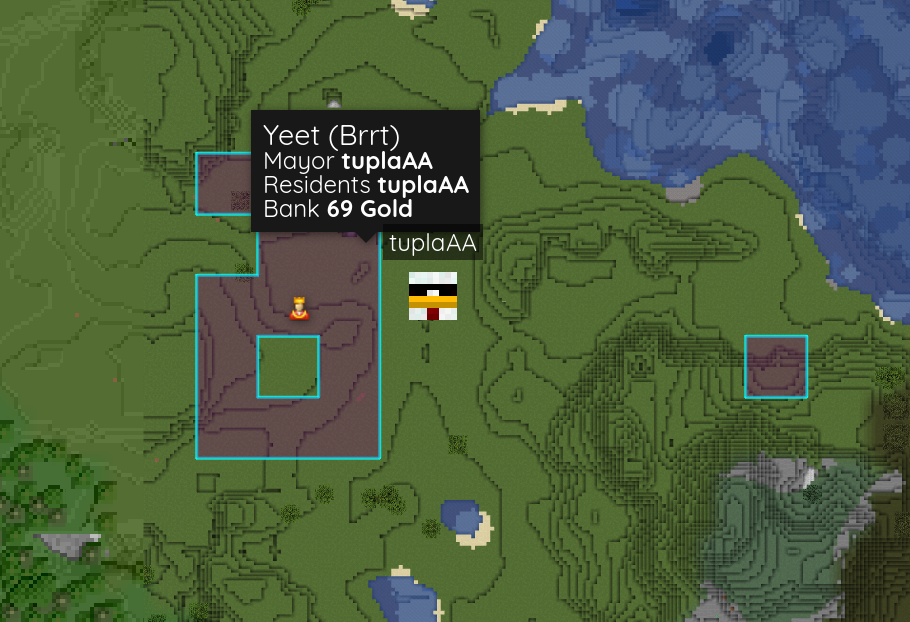
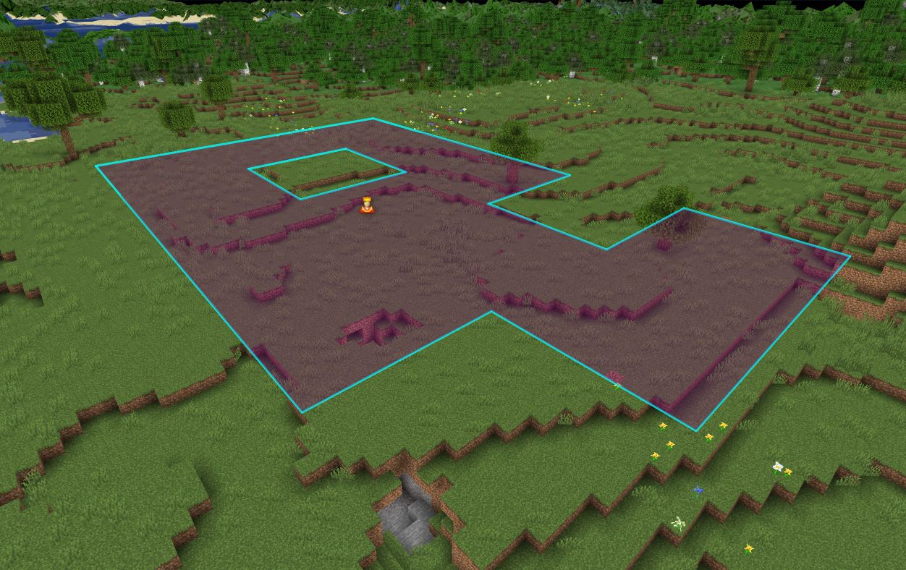

# BlueMap-Towny

> *[BlueMap](https://github.com/BlueMap-Minecraft/BlueMap) addon for showing your [Towny](https://github.com/TownyAdvanced/Towny) towns on your beautiful map*


[](https://github.com/Chicken/BlueMap-Towny/releases/latest)

Configuration, placeholders and main features heavily inspired by Dynmap-Towny.  
Has support for holes in claims and claims outside main town.  
Does not have support for external plugins hooking into placeholders.

<details>
<summary><span style="font-size:1.5em;">Images</span></summary>





</details>

## Installation

Put the plugin jar file inside your plugins folder and have both Towny and BlueMap installed.

## Config

```yml
# BlueMap-Towny configuration
# https://github.com/Chicken/BlueMap-Towny#config

# Seconds between checks for marker updates
update-interval: 30
# Set by /n set mapcolor
dynamic-nation-colors: true
# Set by /t set mapcolor
dynamic-town-colors: true
# HTML for town popup, placeholders documented in README
popup: '<span style="font-size: 120%">%name% (%nation%)</span><br><span>Mayor <strong>%mayor%</strong></span><br><span>Residents <strong>%residents%</strong></span><br><span>Bank <strong>%bank%</strong></span>'
# HTML for War popup(SiegeWar Only), placeholders documented in README
popup-siege: '<span style="font-size: 120%"><strong>Siege: %attacker% vs %defender%</strong></span><br><hr><span>Town <strong>%name%</strong></span><br><span>Type <strong>%siege_type%</strong></span><br><span>War Chest <strong>%war_chest%</strong></span><br><span>Siege Progress <strong>%sessions_completed%/%sessions_total%</strong></span><br><span>Siege Status <strong>%siege_status%</strong></span><br><span>Siege Balance <strong>%siege_balance%</strong></span><br><span>Banner Control <strong>%banner_control%</strong></span><br><span>Battle Points <strong>%battle_points_attacker% / %battle_points_defender%</strong></span><br><span>Battle Time Left <strong>%battle_time_left%</strong></span>'
# If you want claims with holes in them to show up as fully claimed if only the perimeter is claimed.
# This means that the map will LIE about the actual claim status of the area!!!
lie-about-holes: false
style:
  # Y-level to put markers at
  y-level: 62
  # Town border settings
  border-color: '#FF0000'
  border-opacity: 0.8
  border-width: 3
  # Town fill settings
  fill-color: '#FF0000'
  fill-opacity: 0.35
  # Path to icons on web or a link
  # Town home
  home-icon-enabled: false
  home-icon: assets/house.png
  # Nation capital
  capital-icon-enabled: false
  capital-icon: assets/king.png
  # Icon during war
  war-icon-enabled: false
  war-icon: assets/war.png
  # Icon for ruined towns
  ruined-icon-enabled: false
  ruined-icon: assets/ruined.png
```

### Popup placeholders

| Placeholder              | Content                                                                |
|--------------------------|------------------------------------------------------------------------|
| `%name%`                 | Town name                                                              |
| `%mayor%`                | Town mayor                                                             |
| `%residents%`            | Town residents                                                         |
| `%assistants%`           | Town assistants                                                        |
| `%residentdisplaynames%` | Town residents but display names                                       |
| `%residentcount%`        | Number of town residents                                               |
| `%founded%`              | Town founding date                                                     |
| `%board%`                | Town board text                                                        |
| `%trusted%`              | Town trusted residents                                                 |
| `%tax%`                  | Town tax                                                               |
| `%bank%`                 | Town bank balance                                                      |
| `%nation%`               | Nation of the town                                                     |
| `%nationstatus%`         | Capital/Member of ...                                                  |
| `%public%`               | Town publicity status                                                  |
| `%peaceful%`             | Is the town peaceful                                                   |
| `%flags%`                | Flags of the town (pvp, mobs...)                                       |
| `%war%`                  | Has active war (Works for EventWar/FlagWar)                            |
| `%town_culture%`         | Culture of town, see https://github.com/TownyAdvanced/TownyCultures    |
| `%town_resources%`       | Resources of town, see https://github.com/TownyAdvanced/TownyResources |

### [SiegeWar](https://github.com/TownyAdvanced/SiegeWar) Placeholders

| Placeholder                | Content                                     |
|----------------------------|---------------------------------------------|
| `%attacker%`               | Attacking town/nation in war                |
| `%defender%`               | Defending town/nation in war                |
| `%siege_type%`             | Type of Siege (Conquest, Revolt etc)        |
| `%sessions_completed%`     | Battle Sessions completed                   |
| `%session_total%`          | Total amount of Battle Sessions             |
| `%war_chest%`              | War Chest (If economy is enabled for Towny) |
| `%banner_control%`         | the ones controlling the banner             |
| `%siege_status%`           | Siege status                                |
| `%siege_balance%`          | Siege balance                               |
| `%battle_points_attacker%` | Battle points on the attacker's side        |
| `%battle_points_defender%` | Battle points on the defender's side        |
| `%battle_time_left%`       | Time left in the Battle Session             |

## Building

`./gradlew clean build`

Output in `build/libs/`
